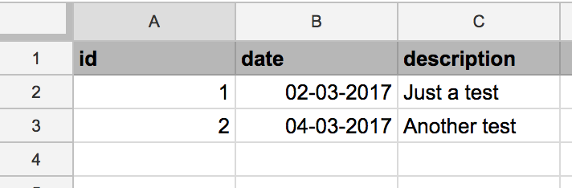

# google-sheets-node


Work in progress... Stay tuned.

# Usage
The library supports 2 ways of interacting with a Google Sheet: getting rows and writing rows.

## Getting rows
```javascript
// Open spreadsheet with ID XXXX-XXXX-XXXX and work with columns A to F in worksheet "Sheet 1"
let sheet = new GSheet('XXXXXXXXXX-XXXXXXXXX-XXXXXXXX', "'Sheet 1'!A:F");

// Get the data
let data = await sheet.getRows();

// Show it
console.log(data);
```

This will map your rows to objects, using the first row of your spreadsheet as name for the values.
Here is an example output for a simple spreadsheet:



```
[ 
    { id: '1', date: '02-03-2017', description: 'Just a test' },
    { id: '2', date: '04-03-2017', description: 'Another test' } 
]
```
